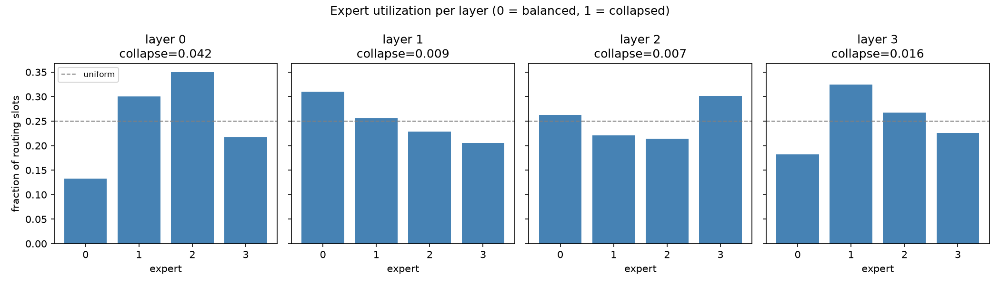
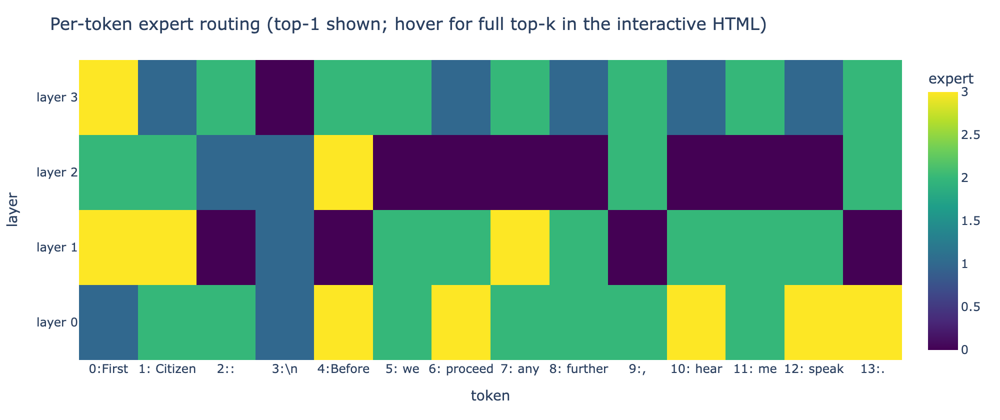
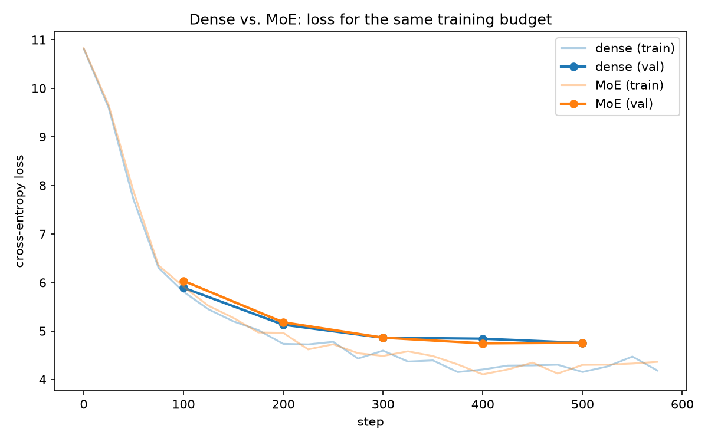
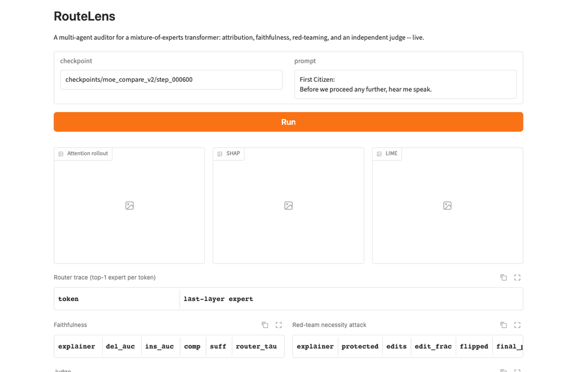

# moe-transformer-from-scratch

A GPT-style transformer with a hand-built Mixture-of-Experts layer: gating network, top-k token routing, capacity-limited dispatch, and load-balancing losses, implemented in raw PyTorch and benchmarked against a parameter-matched dense baseline.

## Highlights

- No `nn.Transformer`, no HuggingFace model classes. Attention, feed-forward, and the MoE layer are all written from primitives.
- Routing is inspectable: which expert handled which token, per layer, is logged and plotted, not just assumed to work.
- Capacity-limited dispatch drops tokens under load, the same tradeoff Switch Transformer and GShard make in production, rather than treating compute as unbounded.
- Dense and MoE models are parameter-matched so the comparison between them means something.
- Runs on a CPU or a free-tier GPU (Kaggle, Colab). No cluster required.
- Includes **RouteLens**, a multi-agent auditor that tests whether SHAP/LIME/attention explanations of this model are faithful -- with seeded 50-prompt evaluations, confidence intervals, and the results that *didn't* hold up reported alongside the ones that did (see [below](#routelens-a-multi-agent-explainability-auditor)).

## Why this exists

Mixture-of-Experts is the architecture behind most large-scale language models in production today: a router sends each token to a small subset of expert feed-forward layers instead of one large shared one, so total parameters can grow without a matching increase in compute per token. The interesting problems show up in what happens when the router misbehaves. It can collapse onto one or two experts and ignore the rest, a single popular expert can be handed more tokens than a batch was sized for, and the routing decision itself is discrete, so gradients need a path around it rather than through it. This project implements the standard production fixes for each of those (a load-balancing auxiliary loss, capacity-based token dropping, and a router z-loss for stability) and includes the tooling to check whether they worked, rather than taking that on faith.

## Architecture

```
Input tokens
     |
     v
Token Embedding          (position info: RoPE, applied inside attention below)
     |
     v
Transformer Block x N
  |
  |-- RMSNorm -> Causal Self-Attention (RoPE on Q/K) --+ (residual)
  |
  |-- RMSNorm -> Router (top-k over E experts)
  |                 |
  |          selected experts (SwiGLU FFN each)
  |                 |
  |          weighted combine --+ (residual)
     |
     v
RMSNorm -> Linear head (tied to embedding) -> logits
```

RMSNorm + RoPE + SwiGLU is the Llama/Mixtral-style recipe rather than 2019 GPT-2's LayerNorm + learned positional embeddings + GELU: it's what current production MoE models (Mixtral, DeepSeek-MoE, Qwen-MoE) actually use, and RoPE avoids a fixed-context-length position table.

Each MoE layer also produces an auxiliary loss (load-balancing + router z-loss), averaged across layers and added to the main cross-entropy loss during training.

## Project structure

```
moe-transformer-from-scratch/
├── pyproject.toml                          # installable package (src/ layout) + pytest config
├── requirements.txt
├── configs/
│   ├── config.yaml                          # composes the groups below, all overridable from the CLI
│   ├── model/default.yaml                    # ModelConfig fields (dense and MoE share one schema)
│   ├── training/default.yaml                  # LR schedule, batch size, checkpointing, device
│   ├── data/default.yaml                       # corpus paths
│   ├── analysis/default.yaml                    # routing_analysis.py settings
│   └── compare/default.yaml                      # compare.py settings
├── data/
│   ├── raw/                                 # source corpus (TinyShakespeare for dev)
│   └── processed/                            # tokenized .bin files (generated, gitignored)
├── src/moe_transformer/
│   ├── config.py                             # ModelConfig
│   ├── init.py                                # GPT-2-style (std=0.02) weight init
│   ├── checkpoint.py                           # safetensors save/load (tied-weight safe)
│   ├── data/
│   │   ├── tokenizer.py                        # tiktoken (GPT-2 BPE) wrapper
│   │   └── dataset.py                           # memory-mapped windowed Dataset
│   ├── model/
│   │   ├── norm.py                              # RMSNorm
│   │   ├── rope.py                               # rotary position embeddings
│   │   ├── attention.py                           # causal self-attention (manual, no fused kernel)
│   │   ├── feedforward.py                          # SwiGLU FFN -- also the per-expert module
│   │   ├── block.py                                 # transformer block (dense)
│   │   └── moe.py                                    # router, top-k dispatch, capacity, aux losses
│   ├── models.py                              # DenseGPT and MoEGPT (embedding, blocks, head)
│   ├── train.py                               # training loop
│   ├── routing_analysis.py                    # expert utilization and per-token routing plots
│   └── compare.py                             # dense vs. MoE: loss, params, inference speed
├── scripts/
│   └── prepare_data.py                        # tokenize a raw corpus into train/val .bin files
├── tests/                                    # pytest suite, alongside each module above
├── checkpoints/                              # saved model weights (.safetensors, gitignored)
└── outputs/                                  # generated charts and reports
```

## Installation

```bash
git clone <this-repo>
cd moe-transformer-from-scratch
python3 -m venv .venv
.venv/bin/pip install -r requirements.txt
.venv/bin/pip install -e .
```

Requires Python 3.11+. Works on CPU; a GPU speeds up training but isn't required for the default config.

**Additional setup for RouteLens only** (the core transformer/MoE project above needs none of this): the Judge agent rates explanations with a local LLM via [Ollama](https://ollama.com), not a paid API. Install it, then:

```bash
ollama serve &
ollama pull llama3.2:3b
```

`ollama serve` must be running whenever you use `run_explainer.py`, `run_batch_eval.py`, or `dashboard.py`. If it isn't, the Judge agent doesn't crash -- it logs a warning, defaults each affected rating to a neutral score flagged `failed: true`, and batch-eval statistics exclude those failed ratings rather than silently averaging them in. Also note this means RouteLens can't run on Kaggle/Colab notebooks (no local Ollama server there), even though the core dense/MoE training does.

## Usage

```bash
# train the MoE model
python -m moe_transformer.train model.kind=moe
# train the dense baseline for comparison
python -m moe_transformer.train model.kind=dense
# override any hyperparameter from the CLI
python -m moe_transformer.train training.max_steps=5000 model.num_experts=8 model.top_k=2
# inspect routing behavior of a trained MoE model
python -m moe_transformer.routing_analysis
# compare dense vs. MoE: loss curves, parameter counts, inference speed
python -m moe_transformer.compare
```

Everything writes to `outputs/` (charts, JSON reports) and `checkpoints/` (`.safetensors` weights).

## What to look at

- `outputs/loss_comparison.png`: dense vs. MoE validation loss for the same training budget.
- `outputs/expert_utilization.png`: per-layer bar chart of how evenly tokens are spread across experts, with a collapse score (0 = balanced, 1 = fully collapsed onto one expert).
- `outputs/routing_heatmap.html` (interactive; `routing_heatmap_preview.png` below is a static snapshot of it): which expert handled each token in a real sentence, at every layer.
- `outputs/comparison_summary.json`: total vs. active parameters, final loss, and inference throughput for both models.

**Expert utilization** (trained MoE checkpoint, 4 layers, collapse scores all under 0.05 -- routing stayed balanced, not collapsed):



**Per-token routing** for the sample sentence "First Citizen: / Before we proceed any further, hear me speak." -- each layer visibly routes differently, not the same fixed pattern repeated (open `outputs/routing_heatmap.html` locally for the interactive version with full top-k weights on hover):



## Results: dense vs. MoE

Both models trained on TinyShakespeare, same architecture width/depth (n_embd=256, n_layer=4), same batch size, on CPU, so the comparison isolates one variable: routing vs. no routing.

**First pass (300 steps, `capacity_factor=1.25`)**: MoE trailed dense noticeably -- val loss 5.31 vs. 5.17. Rather than accept that, I ran a controlled test: retrained MoE with `capacity_factor=100` (effectively no token dropping) to isolate *why*. That closed 64% of the gap, which told me capacity-dropping (tokens genuinely losing their expert's contribution when that expert is full) and the router not having had enough steps to specialize were the two real causes -- not a bug in the routing/dispatch mechanics themselves, which were already covered by the test suite.

**Second pass (600 steps, `capacity_factor=2.0`)**: gave MoE a fairer shot at both -- more training time, and a looser (but still real, still bounded) capacity limit. Result: **MoE matched dense**, val loss 4.759 vs. 4.755 -- within noise of each other. At that point MoE had zero dropped tokens for the entire run, more total parameters than dense (18.64M vs. 16.28M) at the same *active* parameters per token (16.28M, by design -- see `config.moe_expert_hidden_dim`), and equivalent quality. This is the result in `outputs/loss_comparison.png` and `outputs/comparison_summary.json`:



Inference stayed ~12% slower for MoE throughout (13,120 vs. 14,845 tokens/sec) -- training longer doesn't touch that, since it's a dispatch-overhead cost, not a training-quality cost (see Tech stack section below).

**A speed idea I tried that didn't work, and what I learned from it**: to test whether that 12% gap came from the per-expert Python loop's *dynamic shapes* (each expert processes a different, runtime-determined number of tokens), I built an alternative dispatch that runs every expert on every token via fixed-shape batched matrix multiplication (`torch.bmm`), instead of gathering only each expert's assigned tokens. Tested against the real dispatch on the actual trained weights, with capacity effectively unbounded so both are computing the same thing: outputs agreed to within `7.45e-09` (floating-point noise, not an approximation), but it was **~1.65x slower**, not faster, on CPU. That's because it does `num_experts / top_k` times more FLOPs than necessary -- every expert processes every token whether routed there or not -- and on CPU there's no large fixed per-operation cost (no GPU kernel-launch/host-sync tax) for that extra compute to buy its way out of paying. That tradeoff only pays off on a GPU, which is exactly why Megablocks/Tutel/DeepSpeed-MoE exist as GPU-kernel libraries rather than plain-PyTorch tricks. I didn't have GPU hardware to verify that side, so I'm not claiming it -- only that the CPU case doesn't work, and now I know precisely why, instead of guessing. (This dispatch variant isn't in the source tree -- it was a throwaway diagnostic, not something the project depends on, so I kept the result and dropped the code.)

## Tech stack

| Purpose | Tool |
|---|---|
| Framework | PyTorch |
| Tokenization | tiktoken (GPT-2 BPE) |
| Config | Hydra |
| Checkpoints | safetensors |
| Visualization | matplotlib, plotly |
| Testing | pytest |

The expert dispatch in `src/moe_transformer/model/moe.py` gathers and scatters tokens with plain PyTorch ops, functionally identical to what Switch Transformer and GShard describe. Production systems replace that with fused GPU kernels (Megablocks, Tutel, DeepSpeed-MoE) because a per-expert Python loop is slow. `python -m moe_transformer.compare` measures this directly rather than just asserting it: at matched active parameters, MoE ran ~12% slower than dense (see Results below) -- fewer active FLOPs per token, more wall-clock time, exactly the gap those kernel libraries exist to close.

## Testing

```bash
pytest tests/ -v
```

Tests target the parts of MoE that are easy to get subtly wrong: routing weights renormalize to sum to 1, capacity limits actually drop tokens under load, gradients reach the router through the soft routing probabilities, and a deliberately collapsed router scores worse on the load-balancing loss than a balanced one does.

## Scaling to a full run

The default config is sized to train in minutes on a CPU. For a larger result, point `scripts/prepare_data.py --input` at a bigger corpus (e.g. TinyStories or WikiText, downloaded separately -- there's no bundled downloader yet) and scale up the model:

```bash
python scripts/prepare_data.py --input data/raw/your_larger_corpus.txt --output-dir data/processed
python -m moe_transformer.train model.kind=dense model.n_embd=384 model.n_layer=6 training.max_steps=10000
python -m moe_transformer.train model.kind=moe model.n_embd=384 model.n_layer=6 model.num_experts=8 training.max_steps=10000
python -m moe_transformer.routing_analysis model.n_embd=384 model.n_layer=6 model.num_experts=8
python -m moe_transformer.compare model.n_embd=384 model.n_layer=6 model.num_experts=8
```

At this scale, expert routing tends to show real specialization (different experts activating for punctuation, dialogue, or rare tokens, for instance) rather than the near-uniform routing a small, briefly-trained model produces.

## RouteLens: a multi-agent explainability auditor

A second project layered on top of this one (`src/moe_transformer/xai/`), built to actually learn explainable ML (SHAP, LIME, attention visualization) and multi-agent system design rather than read about them. Most XAI demos stop at producing a heatmap. RouteLens's throughline is checking whether the heatmap is *true*, and tying that check to the one thing that makes this model different from any other transformer: the routing decision itself.

For any next-token prediction, six agents run as a hand-rolled state machine (no LangGraph/AutoGen -- the point of a multi-agent learning project is writing the control flow yourself):

```
Explainer -> Faithfulness -> Red-Team -> Judge -> Report
                                  ^          |
                                  '-- retry -'   (if a red-team result was inconclusive)
```

- **Explainer** -- SHAP, LIME, attention rollout, and (for the MoE model) the router's own per-token expert trace, on one next-token prediction.
- **Faithfulness** -- deletion/insertion AUC, comprehensiveness/sufficiency (ERASER-style), and **Router-Attribution Agreement**: this project's own metric, Kendall's tau between attention's per-token importance and the router's per-token gate-weight commitment.
- **Red-Team** -- a *necessity attack*: freezes each explainer's top-20% "important" tokens, then greedily substitutes the rest with the model's own embedding-nearest-neighbor tokens, searching for the fewest edits that flip the prediction anyway. Fewer edits needed means the explainer missed where the model's real sensitivity lives.
- **Judge** -- an independent local LLM (Ollama, `llama3.2:3b`) rates how *plausible* each explanation sounds, blind to the faithfulness numbers, then flags cases where a convincing-sounding explanation is actually unfaithful (in practice a 3B model rates nearly everything ~4/5 -- see the results below).
- **Report** -- one markdown report per prediction, or aggregated across a batch of prompts.

Zero paid APIs anywhere in the pipeline -- SHAP, LIME, the embedding-based attack, and the Judge's LLM all run local and offline.



### Usage

```bash
# explain one prediction end to end (attribution -> faithfulness -> red-team -> judge -> report)
python -m moe_transformer.xai.run_explainer xai.checkpoint=checkpoints/moe_compare_v2/step_000600
# aggregate the same pipeline across 50 seeded prompts, with bootstrap confidence intervals
python -m moe_transformer.xai.run_batch_eval xai.checkpoint=checkpoints/moe_compare_v2/step_000600 xai.out_dir=outputs/xai/batch_moe_step600
# interactive dashboard: type a prompt, see every method side by side, live
python -m moe_transformer.xai.dashboard
```

Writes attribution charts, `explanation_summary.json`, and `report.md` to `outputs/xai/`.

### Results

Batch evaluation over **50 prompts** sampled (seed 1337) from TinyShakespeare, on three checkpoints: the main MoE model (step 600), an earlier MoE checkpoint (step 300), and the dense baseline (step 600). Everything stochastic is seeded (prompt sampling, LIME, the judge at temperature 0) and every number is a mean with a 95% bootstrap CI over prompts. Full tables and per-prompt records are in `outputs/xai/batch_*/`.

**Red-team necessity attack** -- flip rate, and the fraction of editable ("unimportant") tokens needed to flip the prediction (lower = the explainer missed more of what the model relies on):

| checkpoint | explainer | flip rate | edit fraction to flip |
|---|---|---|---|
| MoE, step 600 | attention | 0.86 [0.76, 0.94] | **0.33** [0.25, 0.42] |
| | shap | 1.00 [1.00, 1.00] | 0.16 [0.14, 0.18] |
| | lime | 0.98 [0.94, 1.00] | 0.18 [0.15, 0.22] |
| MoE, step 300 | attention | 0.70 [0.56, 0.82] | **0.46** [0.35, 0.56] |
| | shap | 1.00 [1.00, 1.00] | 0.17 [0.14, 0.21] |
| | lime | 0.98 [0.94, 1.00] | 0.20 [0.16, 0.25] |
| Dense, step 600 | attention | 0.82 [0.70, 0.92] | **0.34** [0.25, 0.44] |
| | shap | 1.00 [1.00, 1.00] | 0.15 [0.13, 0.18] |
| | lime | 0.98 [0.94, 1.00] | 0.19 [0.15, 0.24] |

**What held up, and replicated on all three models:**

- Every explainer can be broken: editing only the tokens it called unimportant flips the prediction on 100% of prompts for SHAP, 98% for LIME, and 70-86% for attention.
- Attention is the hardest to break, needing roughly twice as many edits as SHAP or LIME (confidence intervals don't overlap). "Hardest to break" is a relative claim -- it still breaks most of the time.
- SHAP's comprehensiveness is *negative* on both MoE checkpoints (-0.105 [-0.177, -0.033] and -0.138 [-0.192, -0.086]): removing the tokens SHAP ranks as most important makes the model, on average, *more* likely to predict the target. It is small and positive on the dense model (0.051), so this may be specific to how SHAP's word-level masking interacts with routed models -- I haven't isolated why.

**What did not hold up:** an earlier 5-prompt run suggested "attention never flips" and "LIME sounds the most convincing but is the least faithful". Both were small-sample artifacts, and I've retracted them. Two more honest negatives from the 50-prompt runs:

- **Router-Attribution Agreement is ~0.** Kendall's tau between attention rollout and the router's gate weights is -0.025 [-0.101, 0.048] on the main MoE checkpoint and weakly negative (-0.119 [-0.195, -0.048]) at step 300. I built this metric expecting attention to track routing; on this model it doesn't (an earlier single-prompt value of +0.209 did not generalize).
- **The judge can't tell explainers apart.** A local 3B model rates all three about 3.9-4.0 out of 5, so the "plausible but unfaithful" divergence rate (0.48-0.92) mostly restates the red-team flip rate rather than adding an independent signal. A stronger judge, or human ratings on a subset, would be needed to test the plausibility-vs-faithfulness question properly.

**Limits:** models this small (600 CPU training steps on TinyShakespeare) may not transfer to real LLMs; prompts come from one corpus; one seed; the attack is greedy, so "edits needed" is an upper bound; and "flipped" means the target token's probability dropped by at least 50% (`redteam_flip_threshold`).

Three real bugs surfaced along the way, not injected for demonstration: LIME's `as_list()` only returns a re-ranked subset of words (useless for anything positional, rebuilt via LIME's own `IndexedString`); device resolution ran before a checkpoint's model kind was known, which could have silently routed a MoE model onto MPS (this project's own docs already flag that as pathologically slow); and SHAP's default word masker silently drops trailing text when a prompt doesn't end in whitespace.

## Author

Meeta Dave, M.Sc. Web Engineering, TU Chemnitz

- LinkedIn: [linkedin.com/in/meetadave](https://linkedin.com/in/meetadave)
- Email: [davemeeta12@gmail.com](mailto:davemeeta12@gmail.com)

Built with Claude Code as a hands-on collaborator. Thanks, Claude Code! :) 
